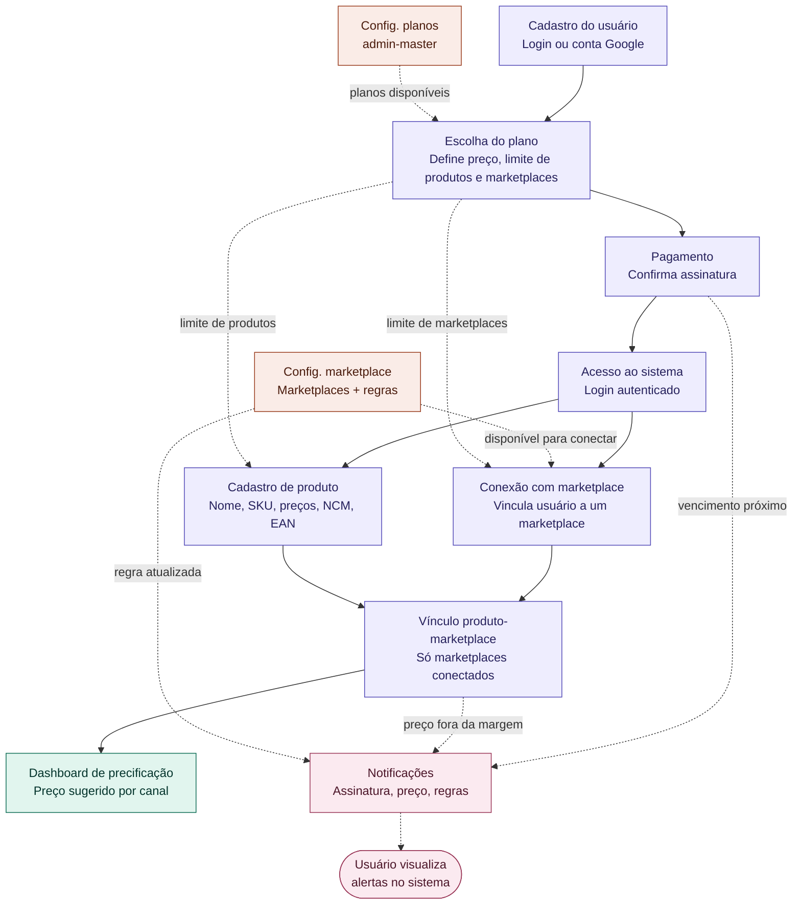
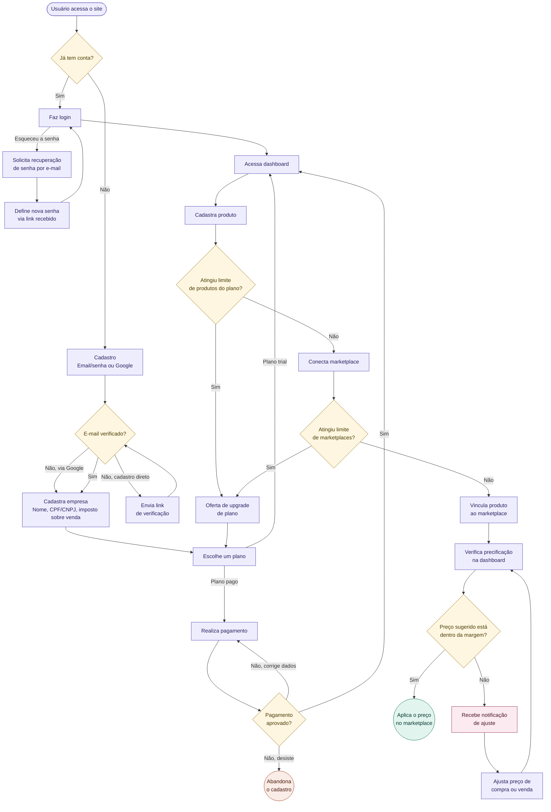

# Plataforma SaaS de Precificação para Marketplace

Documento de referência do MVP: modelo de dados, regras de negócio, fluxo do sistema e jornada do usuário.

---

## 1. Visão geral

Plataforma que permite ao vendedor cadastrar produtos, conectar contas de marketplaces (Shopee, TikTok Shop, Amazon, Mercado Livre etc.) e visualizar o preço que deve praticar em cada canal, considerando as regras de comissão/taxa de cada marketplace e a margem de lucro que o próprio vendedor definiu para aquele produto.

**Fluxo macro:**
usuário se cadastra → assina um plano → paga → acessa o sistema → cadastra produtos → conecta marketplaces → vincula produtos aos marketplaces conectados → consulta a dashboard de precificação.

---

## 2. Modelo de dados (Entidades)

### 2.1 Autenticação e usuários

- **`USER`** — dados da conta. `role` distingue `admin_master` de `user` e é o **único** controle de acesso no MVP (sem granularidade por grupo/tela — ver seção 6). `email_verified_at` fica nulo até a confirmação do e-mail (irrelevante para contas via Google, que já vêm verificadas pelo provider). `status` (`active`/`deleted`, default `active`) marca exclusão da própria conta pelo usuário (LGPD) — soft delete/anonimização (`name`/`email`/`password` apagados), nunca `DELETE` físico; histórico financeiro/auditoria ligado ao `id` continua íntegro. Não usa `SoftDeletes`/`deleted_at` nativo do Laravel de propósito — esconderia a linha de toda query por Global Scope, inclusive a futura tela de admin que precisa listar/ver qualquer usuário. **Não guarda mais `document`** (removido 2026-09-02, pedido direto do usuário) — CPF/CNPJ agora mora em `COMPANY`.
- **`COMPANY`** — cadastro de empresa do vendedor (`name`, `document`, `sales_tax_percentage` — "imposto sobre venda", só armazenado nesta rodada, ainda sem uso em nenhuma regra de precificação). `tax_regime` (decisão 2026-09-08, pedido direto do usuário) — regime tributário do vendedor (`individual`/PF, `mei`, `simples_nacional`), nullable/opcional; **puramente informativo**, sem nenhuma regra de negócio conectada — o frontend mostra um aviso de que porte maior que os 3 listados aqui não é contemplado pela plataforma, mas o backend aceita qualquer um dos 3 valores sem bloquear nada. `operational_cost_percentage` (decisão 2026-09-08, pedido direto do usuário — corrigido no mesmo dia: mora na EMPRESA, não em `USER_MARKETPLACE`) é um percentual NOVO, um valor só pra empresa toda (mesmo raciocínio de `sales_tax_percentage`, não varia por conexão/canal) — entra na fórmula de precificação (seção 3) deduzido do lucro, mesmo tratamento de `ads_percentage`/`affiliate_percentage`; desambiguado de `PRODUCT.shipping_cost` (era `PRODUCT.operational_cost`, valor FIXO em R$, renomeado no mesmo dia pra não colidir de nome — ver §2.3). Unique `(user_id)` — 1 empresa por usuário. **Obrigatória antes de assinar um plano** (`SubscribeToPlanAction` recusa com `422 errorMessageCompanyRequired` sem ela — `requires_company` em `/auth/me`/`/auth/login` sinaliza isso pro front, mesmo padrão de `requires_subscription`), gate que vale tanto pra cadastro manual quanto via SSO. `document` aceita CPF (11 dígitos) ou CNPJ (14), validado via `Domain\Identity\ValueObjects\Document`. `responsible_document` (CPF, nullable) é **obrigatório só quando `document` é CNPJ** — achado real, pesquisado antes de implementar: o Mercado Pago só aceita CPF como documento do pagador (`GET /v1/identification_types` pra Brasil devolve só `CPF`), então uma empresa PJ precisa de um CPF de responsável separado pra eventual uso no checkout. Ao excluir a própria conta (LGPD), `COMPANY` é apagada por completo (hard delete, não anonimização — CPF/CNPJ é exatamente o dado que o pedido de exclusão quer remover, e nada mais referencia `COMPANY.id`).
- **`PASSWORD_RESET`** — tabela padrão de recuperação de senha (mesmo padrão do Laravel: chave por `email`, sem FK). Pertence ao contexto `Identity`, junto com `USER`, `SSO_ACCOUNT` e `COMPANY`.
- **`SSO_ACCOUNT`** — login social separado do usuário. Um `USER` pode ter várias contas SSO (`provider` + `provider_id`). Providers previstos: `google`, `microsoft`. Guarda `access_token`/`refresh_token`/`expires_at` do provider (nullable, criptografados em repouso) — necessário pra revalidar a sessão OAuth quando o token expira, não só pro login inicial.

### 2.2 Planos e assinatura

- **`PLAN`** — define preço, ciclo de cobrança e os limites do plano: `max_products` e `max_marketplaces`. Não controla mais visibilidade de tela (ver seção 6) — só limites numéricos, validados na aplicação. `is_trial`/`trial_days` (decisão 2026-08-31) marcam o plano trial (10 dias, sem cobrança) — `billing_cycle` ganha o valor `trial` pra esse plano, nem `monthly` nem `yearly`.
- **`SUBSCRIPTION`** — assinatura do usuário a um `PLAN`, com `status`, `start_date`, `end_date`. Modelo é **1 login = 1 assinatura**: `USER` tem histórico de `SUBSCRIPTION` (troca de plano, renovação), mas nunca duas ativas ao mesmo tempo — troca de plano **atualiza a mesma linha** (não cria uma nova `SUBSCRIPTION`). `pending_plan_id` (nullable) guarda uma troca de plano solicitada aguardando confirmação de pagamento via checkout Mercado Pago prorata — `plan_id` só muda de verdade quando o webhook aprova o pagamento. `cancel_at_period_end` (boolean, default `false`) marca cancelamento da renovação sem `DELETE` físico — usuário mantém acesso normal até `end_date` do ciclo já pago, sem reembolso; `status` continua `active` normalmente (mesmo modelo do Stripe).
- **`TRANSACTION`** — histórico de cobranças (assinatura e demais compras), com `gateway`, `gateway_transaction_id`, `status`, `value`, `payment_method`. Ligada a `USER` e, quando aplicável, a `SUBSCRIPTION`.

### 2.3 Produtos

- **`PRODUCT`** — cadastro do produto: `name`, `sku`, `ean`, `ncm`, `cost_price`, `target_margin` (percentual de lucro mínimo aceitável definido pelo próprio vendedor — é contra esse valor que o sistema compara o `suggested_price` para decidir se dispara notificação de ajuste). **`ean`/`ncm` são nullable/opcionais no cadastro desde 2026-09-04** (pedido direto do usuário — nem todo vendedor tem os dois códigos em mãos no momento do cadastro), continuam validados no formato (`Domain\Catalog\ValueObjects\Ean`/`Ncm`) só quando informados. `shipping_cost` (nullable, renomeado de `operational_cost` em 2026-09-08 — pedido direto do usuário, pra não colidir de nome com `COMPANY.operational_cost_percentage` novo, ver §2.1) soma os custos de envio do produto (embalagem, etiqueta, frete etc.) — opcional, valor FIXO em R$, entra na fórmula de precificação (seção 3) subtraído direto do lucro, mesmo tratamento algébrico de `cost_price`. `weight` (kg) e `height`/`width`/`length` (cm) são opcionais (nullable) — mesma convenção de unidade usada por Correios/Shopee/Mercado Livre pra cálculo de frete; hoje só armazenados, ainda sem uso em nenhuma regra de precificação/frete. **`full_sale_price` ("preço de venda") removido do cadastro em 2026-09-02** (pedido direto do usuário) — nunca teve regra de negócio conectada (`PricingCalculator`, existente e testado isoladamente, nunca ligado a rota nenhuma); `purchase_price` ("preço de compra") foi renomeado pra `cost_price` ("preço de custo") no mesmo dia, mesmo dado, nome mais preciso pro que o vendedor de fato preenche.

### 2.4 Marketplaces e precificação

- **`MARKETPLACE`** — cadastro do canal de venda (Shopee, TikTok, Amazon, ML etc.), mantido pelo admin. `logo_url`/`description`/`tags`/`website_url` são nullable, cadastro visual pra tela de conectar marketplace (pedido do front, 2026-08-31). `logo_url` NUNCA aceita link externo (decisão revista no mesmo dia, pedido direto do usuário) — o admin manda a imagem em base64, o backend valida/decodifica/hospeda no disco `public` do Laravel e persiste a URL própria; `tags` é array simples sem entidade própria. `coming_soon` (decisão 2026-09-02, pedido direto do usuário, default `false`) sinaliza um canal "em breve" — ortogonal a `active`: o marketplace continua aparecendo em `GET /v1/marketplaces` (front usa a flag pra mostrar o aviso), mas `CreateUserMarketplaceAction` recusa (`422 errorMessageMarketplaceComingSoon`) qualquer tentativa de conectar enquanto `coming_soon=true`. `requires_store_document_type` (decisão 2026-09-04, pedido direto do usuário, default `false`) sinaliza que aquele marketplace precisa saber se a loja do vendedor é PF ou PJ — mesmo raciocínio de `coming_soon`: aparece em `GET /v1/marketplaces` (front usa pra mostrar o campo no formulário de conexão) e `CreateUserMarketplaceAction` recusa (`422 errorMessageStoreDocumentTypeRequired`) conectar sem informar `USER_MARKETPLACE.store_document_type` enquanto `requires_store_document_type=true`. `individual_fixed_fee` (decisão 2026-09-04, pedido direto do usuário) é a "taxa fixa para PF" que o marketplace cobra — nullable; entra no `ProductMarketplacePricingCalculator` (ver seção 3) condicionada a `USER_MARKETPLACE.store_document_type=individual` da conexão (PF) — em PJ ou sem tipo definido, não entra na conta.
- **`PRICING_RULE`** — regras de cobrança do marketplace, por faixa de valor: `range_min`, `range_max`, `percentage`, `fixed_fee`, `order`. Permite quantas faixas forem necessárias por marketplace (ex.: até R$40 → 20% + R$4; acima de R$40 → 40% + R$10).
- **`USER_MARKETPLACE`** — vínculo do usuário com um marketplace (a "conta/loja" dele naquele canal). É essa entidade que limita quais marketplaces um produto pode ser vinculado. `ads_percentage`/`campaign_discount_percentage`/`affiliate_percentage` (decisão 2026-09-02, pedido direto do usuário) são percentuais opcionais/nullable da própria conta naquele canal — nem todo vendedor usa ads, roda campanha com desconto ou vende via afiliado. Entram no cálculo do `ProductMarketplacePricingCalculator` desde 2026-09-03 (ver seção 3). `coupon_value` (decisão 2026-09-04, pedido direto do usuário) é o valor de cupom que a conta costuma dar no canal — **valor FIXO em R$, não percentual**, diferente dos 3 campos acima; também opcional/nullable, e também entra no cálculo (seção 3). `store_document_type` (decisão 2026-09-04, pedido direto do usuário) sinaliza se a loja do usuário naquele canal é `individual` (PF) ou `company` (PJ) — nullable/opcional em geral, mas **obrigatório no momento de conectar** (`POST /v1/user-marketplaces`) quando `MARKETPLACE.requires_store_document_type=true` pro marketplace escolhido (`422 errorMessageStoreDocumentTypeRequired` sem ele); editável depois via `PATCH /v1/user-marketplaces/{id}`.
- **`PRODUCT_MARKETPLACE`** — vínculo do produto com um `USER_MARKETPLACE` (não com o marketplace direto — isso garante que só é possível vincular produto a um marketplace que o próprio usuário já conectou). **Decisão 2026-08-26**: nesta rodada é um vínculo puro (`product_id` + `user_marketplace_id`), sem `suggested_price`/`is_approximated` — o cálculo de preço sugerido (`PricingCalculator`, já existente e testado isoladamente, nunca conectado a rota nenhuma) fica pra uma tela/tabela futura, ainda não desenhada. Só é possível criar o vínculo se o `USER_MARKETPLACE` referenciado estiver `active`. **`category_id`** (nullable, decisão 2026-09-02, pedido direto do usuário) — categoria escolhida pelo usuário nesse vínculo; só aceita uma `PRODUCT_CATEGORY` que já tenha `CATEGORY_MARKETPLACE` cadastrado especificamente pro marketplace desse vínculo (o seletor no front só mostra essas), nunca uma categoria qualquer. Marketplaces que não cobram comissão por categoria simplesmente não têm nenhuma `CATEGORY_MARKETPLACE`, então o campo fica de fora. **`practiced_price`** (nullable, decisão 2026-09-03) — essa É a "tela futura" prevista acima, finalmente implementada: o preço de venda que o vendedor pratica de fato nesse canal, usado pelo `ProductMarketplacePricingCalculator` pra checar se bate a margem alvo do produto ou sugerir um novo preço (ver seção 3). **Vínculo automático (decisão 2026-09-10, pedido direto do usuário)**: todo `PRODUCT` já nasce vinculado a toda `USER_MARKETPLACE` ativa do mesmo dono, e toda `USER_MARKETPLACE` nova nasce vinculada a todo `PRODUCT` já cadastrado — sem passo manual, `practiced_price` sempre `null` nesses vínculos automáticos (nunca `0` — zeraria o denominador de `Margem% = Lucro ÷ Venda` no Calculator). `POST /v1/products/{id}/marketplaces` (criação manual do vínculo) virou idempotente por causa disso: chamar pra um vínculo que já existe não é mais `422` — devolve (e, se vier `category_id`, atualiza) o vínculo já existente. **`DELETE` do vínculo foi removido no mesmo dia** — desde que todo vínculo nasce e se mantém automático (um seeder de backfill, create-if-missing, roda em todo deploy recriando qualquer vínculo faltante), "desvincular" deixou de ter sentido como ação permanente: seria silenciosamente desfeito no próximo deploy. `category_id`, que antes só mudava via `DELETE`+`POST` de novo, virou mutável direto em `PATCH` por causa disso.
- **`PRODUCT_CATEGORY`** — categoria de produto (`title`, `active`), cadastrada pelo admin. Simples e plana, **sem hierarquia/subcategoria** (decisão 2026-09-02 — uma primeira versão com `parent_id` foi revertida a pedido do usuário). `active=false` esconde a categoria da seleção pra NOVOS vínculos (`CATEGORY_MARKETPLACE` e `PRODUCT_MARKETPLACE.category_id`), não desfaz os existentes.
- **`CATEGORY_MARKETPLACE`** — vínculo entre uma `PRODUCT_CATEGORY` e um `MARKETPLACE`, com a comissão (`commission_percentage`) que aquele marketplace cobra pra produtos daquela categoria, cadastrado pelo admin. **Nem todo marketplace cobra por categoria** — essa tabela não tem uma linha obrigatória por marketplace, só existem os vínculos que o admin de fato cadastrar. Unique `(category_id, marketplace_id)`.

### 2.5 Notificações, auditoria e configuração

- **`NOTIFICATION`** — conteúdo de um evento in-app (`type`, `title`, `message`, `status`), agnóstico de usuário (decisão 2026-08-26 — antes era 1 linha por destinatário). `title`/`message` aceitam tanto uma **chave** catalogada (`NotificationMessageKey`, mesma disciplina do `ApiMessageKey` das respostas de erro/sucesso da API) quanto texto livre — quem decide traduzir ou mostrar cru é o front, o backend só grava o que vier. `status` (`pending`/`sending`/`sent`/`cancelled`) só é relevante pra broadcast (envio pra 1 usuário nasce direto em `sent`, síncrono). Tipos previstos: vencimento de assinatura, preço fora da margem, regra de marketplace atualizada, lançamento registrado, **assinatura ativada** (implementado na Fase 4, tarefa 18 — `NotificationType::SubscriptionActivated`), **início de impersonation** (tarefa 29), **aviso do admin** (`AdminAnnouncement`, tarefa 42), **chamado aberto** (`TicketOpened`, tarefa 61 — todo `admin_master` recebe, ver seção 2.6).
- **`USER_NOTIFICATION`** — entrega de uma `NOTIFICATION` pra 1 destinatário específico (`user_id`, `notification_id`, `read`). É aqui que mora "lida"/"não lida" — nunca em `NOTIFICATION`, que é conteúdo compartilhado sem dono. Um broadcast pra N usuários é sempre 1 `NOTIFICATION` + N `USER_NOTIFICATION`.
- **`AUDIT_LOG`** — log de auditoria: `action`, `module`, `description`, `ip_address`, ligado ao `USER` que executou a ação.
- **`SETTINGS`** — configurações internas da aplicação em formato chave-valor (`hash` como PK única, `name`, `value`, `type`). Tipos aceitos: `int`, `string`, `enum`, `text`, `json`, `bool`, `float`.
- **`USER_FAVORITE`** — atalho de navegação da sidebar do front pra uma tela favoritada pelo próprio usuário (`label`, `route_name` — nome da rota do Vue Router, não path/URL). Pedido pelo front em 2026-08-31 (feature de conveniência de UI, não regra de negócio de precificação). Unique `(user_id, route_name)` — não dá pra favoritar a mesma rota duas vezes.

### 2.6 Chamados de suporte (Support)

Bounded Context novo (decisão 2026-09-01, pedido direto do usuário — nenhum dos outros 5 contextos cobre isso de verdade, é domínio de negócio próprio, não preferência de UI).

- **`TICKET`** — chamado aberto por um usuário (`user_id`, `subject`, `status`). `status` tem 3 valores: `open` (nasce assim) → `in_progress` (decisão 2026-09-08, pedido direto do usuário: "fica muito confuso saber o q ta aberto e o q nao ta" — vira `in_progress` **automaticamente** assim que um `admin_master` responde pela primeira vez, sem passo manual/endpoint dedicado; idempotente, uma 2ª resposta do admin não faz nada, e não reabre um chamado já `resolved`) → `resolved`. Contestar uma resolução (só quem abriu pode) volta o status direto pra `open` (não `in_progress`), sem um 3º fluxo próprio; a mensagem explicando a contestação já fica registrada no histórico de `TICKET_MESSAGE`. `resolved_at`/`resolved_by` (nullable) marcam quando/quem resolveu — `resolved_by` pode ser o próprio dono do chamado OU qualquer `admin_master` (ambos podem marcar como resolvido; sem atribuição de chamado a um admin específico, mesmo modelo de acesso do resto do projeto). Ao abrir, todo `admin_master` recebe uma `NOTIFICATION` (`NotificationType::TicketOpened`) — só na abertura, resposta nova não notifica nesta rodada.
- **`TICKET_MESSAGE`** — cada mensagem trocada num chamado (`ticket_id`, `user_id`, `body`). Autor pode ser o dono do chamado OU qualquer `admin_master` — sem atribuição, qualquer admin responde qualquer chamado.
- **`TICKET_MESSAGE_ATTACHMENT`** (decisão 2026-09-08, pedido direto do usuário) — imagens anexadas a uma `TICKET_MESSAGE`, até 5 por mensagem. Vale pra toda mensagem do chamado, sem caso especial: mensagem inicial (ao abrir o chamado) e respostas de usuário/admin todas aceitam anexo. Upload em base64 no corpo do request (mesmo padrão já usado por `MARKETPLACE.logo_url`) — o backend decodifica/valida/hospeda no disco `public` do Laravel via `Base64Image::fromDataUri`, `url` é sempre a URL própria hospedada por nós, nunca aceita link externo. `Base64Image` (`Domain/Pricing/ValueObjects`) foi promovido pra `Domain/Shared/ValueObjects` nesta rodada — passou a ser usado por 2 Bounded Contexts (Pricing pro logo de marketplace, Support pro anexo de chamado).

### 2.7 Diagrama de entidades (ERD)

```mermaid
erDiagram
    PLAN ||--o{ SUBSCRIPTION : defines
    USER ||--o{ SUBSCRIPTION : has
    USER ||--o{ PRODUCT : registers
    USER ||--o{ USER_MARKETPLACE : connects
    MARKETPLACE ||--o{ USER_MARKETPLACE : is_connected_by
    MARKETPLACE ||--o{ PRICING_RULE : has
    MARKETPLACE ||--o{ CATEGORY_MARKETPLACE : has
    PRODUCT_CATEGORY ||--o{ CATEGORY_MARKETPLACE : has
    PRODUCT_CATEGORY ||--o{ PRODUCT_MARKETPLACE : categorizes
    PRODUCT ||--o{ PRODUCT_MARKETPLACE : links
    USER_MARKETPLACE ||--o{ PRODUCT_MARKETPLACE : receives
    USER ||--o{ USER_NOTIFICATION : receives
    NOTIFICATION ||--o{ USER_NOTIFICATION : delivered_as
    USER ||--o{ USER_FAVORITE : bookmarks
    USER ||--o{ SSO_ACCOUNT : authenticates_via
    USER ||--o| COMPANY : owns
    USER ||--o{ AUDIT_LOG : generates
    USER ||--o{ TRANSACTION : makes
    SUBSCRIPTION ||--o{ TRANSACTION : generates
    USER ||--o{ TICKET : opens
    TICKET ||--o{ TICKET_MESSAGE : has
    USER ||--o{ TICKET_MESSAGE : writes
    TICKET_MESSAGE ||--o{ TICKET_MESSAGE_ATTACHMENT : has

    PLAN {
        uuid id PK
        string name
        decimal price
        string billing_cycle
        int max_marketplaces
        int max_products
        boolean active
        boolean is_trial
        int trial_days
        timestamp created_at
        timestamp updated_at
    }
    %% is_trial/trial_days (decisão 2026-08-31, reabre o ponto "Trial: não
    %% entra no MVP" com novo motivo de negócio — pedido direto do usuário):
    %% is_trial marca o plano trial (só 1 hoje), trial_days é a duração
    %% (10). billing_cycle ganha o valor "trial" (terceiro caso do enum,
    %% nem monthly nem yearly — não é cobrança recorrente de verdade).
    %% SUBSCRIPTION nascida de um plano trial pula PAYMENT/TRANSACTION
    %% inteiramente: nasce direto status=active, sem checkout nenhum.

    USER {
        uuid id PK
        string name
        string email
        timestamp email_verified_at
        string password_hash
        string role
        string status
        timestamp created_at
        timestamp updated_at
    }
    %% USER.role accepted values: admin_master, user — único controle de acesso no MVP (sem group_id/menu granular)
    %% USER.status accepted values: active, deleted (default active) — deleted = soft
    %% delete/anonimização (name/email/password apagados, nunca DELETE físico,
    %% histórico financeiro/auditoria ligado ao id continua íntegro). Não usa SoftDeletes/
    %% deleted_at nativo do Laravel de propósito — esconderia a linha de toda query por
    %% Global Scope, inclusive a tela de admin que precisa listar/ver qualquer usuário.
    %% document (CPF/CNPJ) saiu daqui em 2026-09-02 — mora em COMPANY agora.

    COMPANY {
        uuid id PK
        uuid user_id FK
        string name
        string document
        string tax_regime
        string responsible_document
        decimal sales_tax_percentage
        decimal operational_cost_percentage
        timestamp created_at
        timestamp updated_at
    }
    %% Cadastro de empresa do vendedor — obrigatório antes de assinar um plano
    %% (SubscribeToPlanAction recusa sem ela; requires_company em /auth/me e
    %% /auth/login sinaliza isso pro front). unique (user_id): 1 empresa por
    %% usuário. document aceita CPF (11) ou CNPJ (14), validado via
    %% Domain/Identity/ValueObjects/Document. responsible_document (CPF,
    %% nullable) é obrigatório só quando document é CNPJ — Mercado Pago só
    %% aceita CPF como documento do pagador (GET /v1/identification_types
    %% pra Brasil devolve só CPF), pesquisado antes de implementar.
    %% tax_regime (nullable, decisão 2026-09-08, pedido direto do usuário):
    %% individual (PF) / mei / simples_nacional — puramente informativo, sem
    %% regra de negócio conectada (o aviso de porte maior não contemplado é
    %% só texto no frontend, backend não bloqueia nada).
    %% operational_cost_percentage (nullable, decisão 2026-09-08, pedido
    %% direto do usuário — corrigido no mesmo dia: mora aqui, não em
    %% USER_MARKETPLACE): percentual NOVO, um valor só pra empresa toda,
    %% mesmo tratamento de ads_percentage/affiliate_percentage (deduzido
    %% do lucro, considerado no denominador do suggested_price) —
    %% desambiguado de PRODUCT.shipping_cost (era PRODUCT.operational_cost,
    %% valor FIXO em R$, renomeado no mesmo dia pra não colidir de nome).
    %% sales_tax_percentage ("imposto sobre venda") só armazenado nesta
    %% rodada, ainda sem uso em regra de precificação. Hard delete (não
    %% anonimização) quando o usuário exclui a própria conta — nada mais
    %% referencia COMPANY.id, e CPF/CNPJ é exatamente o dado que o pedido de
    %% exclusão (LGPD) quer remover.

    SUBSCRIPTION {
        uuid id PK
        uuid user_id FK
        uuid plan_id FK
        uuid pending_plan_id FK
        string status
        boolean cancel_at_period_end
        string payment_id
        date start_date
        date end_date
        timestamp created_at
        timestamp updated_at
    }
    %% pending_plan_id (nullable): troca de plano solicitada, aguardando
    %% confirmação de pagamento (checkout Mercado Pago prorata) — plan_id só
    %% muda quando o webhook aprova o pagamento
    %% cancel_at_period_end (default false): cancelamento da renovação sem
    %% DELETE físico — mantém acesso até end_date, sem reembolso; status
    %% continua active normalmente (mesmo modelo do Stripe)

    PRODUCT {
        uuid id PK
        uuid user_id FK
        string name
        string sku
        string ean
        string ncm
        decimal cost_price
        decimal shipping_cost
        decimal target_margin
        decimal weight
        decimal height
        decimal width
        decimal length
        timestamp created_at
        timestamp updated_at
    }
    %% cost_price ("preço de custo") era purchase_price, renomeado 2026-09-02
    %% (pedido direto do usuário). shipping_cost (nullable, renomeado de
    %% operational_cost em 2026-09-08, pedido direto do usuário — pra não
    %% colidir de nome com COMPANY.operational_cost_percentage
    %% novo): custos de envio do produto (embalagem, etiqueta, frete etc.)
    %% — opcional, valor FIXO em R$, já subtraído direto do lucro na
    %% fórmula de precificação (seção 3) desde sempre.
    %% full_sale_price ("preço de venda") removido do cadastro no mesmo dia —
    %% nunca teve regra de negócio conectada (PricingCalculator, existente e
    %% testado isoladamente, nunca ligado a rota nenhuma).
    %% weight (kg) e height/width/length (cm) são nullable — opcionais no
    %% cadastro, ainda sem uso em nenhuma regra de precificação/frete
    %% ean/ncm são nullable — opcionais no cadastro desde 2026-09-04 (pedido
    %% direto do usuário, nem todo vendedor tem os dois códigos em mãos no
    %% momento do cadastro), continuam validados no formato (Ean/Ncm VOs)
    %% só quando informados.

    MARKETPLACE {
        uuid id PK
        string name
        boolean active
        boolean coming_soon
        boolean requires_store_document_type
        decimal individual_fixed_fee
        string logo_url
        string description
        json tags
        string website_url
        timestamp created_at
        timestamp updated_at
    }
    %% logo_url/description/tags/website_url nullable — cadastro visual pra
    %% tela de conectar marketplace (pedido do front, 2026-08-31). tags é
    %% array simples (json), sem entidade própria tipo MARKETPLACE_TAG — não
    %% há necessidade de normalizar categorias livres definidas pelo admin.
    %% logo_url NUNCA aceita link externo (decisão revista no mesmo dia,
    %% pedido direto do usuário): o admin manda a imagem em base64
    %% (data:image/png;base64,...), o backend decodifica/valida/hospeda no
    %% disco 'public' do Laravel (Domain/Pricing/ValueObjects/Base64Image +
    %% MarketplaceLogoStorageInterface) e persiste a URL PRÓPRIA aqui —
    %% nunca depende de um link de terceiro que pode cair.
    %% coming_soon (decisão 2026-09-02, default false) — "em breve",
    %% ortogonal a active: aparece em GET /v1/marketplaces (front mostra o
    %% aviso), mas CreateUserMarketplaceAction recusa conectar enquanto true.
    %% requires_store_document_type (decisão 2026-09-04, default false) —
    %% mesmo raciocínio de coming_soon: aparece em GET /v1/marketplaces
    %% (front mostra o campo PF/PJ no formulário de conexão), e
    %% CreateUserMarketplaceAction recusa conectar sem
    %% USER_MARKETPLACE.store_document_type enquanto true (422
    %% errorMessageStoreDocumentTypeRequired). individual_fixed_fee
    %% (nullable) é a "taxa fixa para PF" que o marketplace cobra — entra no
    %% ProductMarketplacePricingCalculator condicionada a
    %% USER_MARKETPLACE.store_document_type=individual da conexão.

    USER_MARKETPLACE {
        uuid id PK
        uuid user_id FK
        uuid marketplace_id FK
        string store_name
        boolean active
        decimal ads_percentage
        decimal campaign_discount_percentage
        decimal affiliate_percentage
        decimal coupon_value
        string store_document_type
        timestamp created_at
        timestamp updated_at
    }
    %% unique (user_id, marketplace_id): 1 conta por marketplace por usuário
    %% ads_percentage/campaign_discount_percentage/affiliate_percentage
    %% (nullable, decisão 2026-09-02): percentuais opcionais da própria
    %% conta/loja do usuário naquele canal — nem todo vendedor usa
    %% ads/campanha/afiliado. Entram no cálculo do ProductMarketplacePricingCalculator
    %% desde 2026-09-03 (pedido direto do usuário): ads/affiliate são
    %% deduzidos do lucro igual imposto; campaign_discount_percentage vira
    %% o "preço de anúncio para desconto" ("VALOR DO ANUNCIO PARA DESCONTO"
    %% da planilha, preço a listar pra bater o preço ativo depois do
    %% desconto de campanha) — nenhum dos 3 mais "só armazenado".
    %% coupon_value (nullable, decisão 2026-09-04, pedido direto do
    %% usuário): valor de cupom que a conta costuma dar no canal — valor
    %% FIXO em R$, não percentual, diferente dos 3 campos acima. Entra no
    %% cálculo do ProductMarketplacePricingCalculator desde o dia em que foi
    %% criado: mesmo tratamento algébrico de PRICING_RULE.fixed_fee (soma
    %% direto no preço sugerido, subtrai direto do lucro — nunca
    %% multiplicado pelo preço de venda).
    %% store_document_type (nullable, decisão 2026-09-04, pedido direto do
    %% usuário): enum individual (PF) / company (PJ) — nullable/opcional em
    %% geral, mas OBRIGATÓRIO no momento de conectar
    %% (CreateUserMarketplaceAction, 422 errorMessageStoreDocumentTypeRequired)
    %% quando MARKETPLACE.requires_store_document_type=true pro marketplace
    %% escolhido. Editável depois via PATCH.

    PRICING_RULE {
        uuid id PK
        uuid marketplace_id FK
        decimal range_min
        decimal range_max
        decimal percentage
        decimal fixed_fee
        int order
        timestamp created_at
        timestamp updated_at
    }

    PRODUCT_MARKETPLACE {
        uuid id PK
        uuid product_id FK
        uuid user_marketplace_id FK
        uuid category_id FK
        decimal practiced_price
        string status
        timestamp created_at
        timestamp updated_at
    }
    %% vínculo puro (decisão 2026-08-26) — suggested_price/is_approximated
    %% removidos nesta rodada, ficam pra uma tela/tabela futura quando o
    %% PricingCalculator (já existente) entrar em uso de verdade
    %% category_id (nullable, decisão 2026-09-02): categoria escolhida pelo
    %% usuário, só aceita PRODUCT_CATEGORY com CATEGORY_MARKETPLACE cadastrado
    %% pro marketplace desse vínculo — validado na Action, não no banco.
    %% practiced_price (nullable, decisão 2026-09-03, planilha real fornecida
    %% pelo usuário — PRECIFICAÇAO.xlsx): preço de venda que o vendedor
    %% pratica de fato nesse canal. É a "tela futura" acima, finalmente
    %% implementada — ProductMarketplacePricingCalculator usa esse preço +
    %% PRODUCT.cost_price/shipping_cost/target_margin +
    %% COMPANY.sales_tax_percentage + USER_MARKETPLACE.ads_percentage +
    %% PRICING_RULE do marketplace pra checar se bate a margem alvo ou
    %% sugerir um novo preço. Endpoint: GET /v1/user-marketplaces/{id}/products.
    %% status (not_sent/pending/sent, default not_sent, decisão 2026-09-10,
    %% pedido direto do usuário): marcado manualmente pelo vendedor na tela
    %% de precificação — puramente informativo, sem regra de negócio
    %% conectada. Editável via PATCH /v1/products/{id}/marketplaces/{id},
    %% mesmo endpoint que já edita practiced_price/category_id.

    PRODUCT_CATEGORY {
        uuid id PK
        string title
        boolean active
        timestamp created_at
        timestamp updated_at
    }
    %% Categoria simples e plana — sem hierarquia/subcategoria (decisão
    %% 2026-09-02, revertida de uma primeira versão com parent_id, pedido
    %% direto do usuário). active=false esconde da seleção pra NOVOS
    %% vínculos, não desfaz os existentes.

    CATEGORY_MARKETPLACE {
        uuid id PK
        uuid category_id FK
        uuid marketplace_id FK
        decimal commission_percentage
        timestamp created_at
        timestamp updated_at
    }
    %% Comissão que um MARKETPLACE cobra pra produtos de uma PRODUCT_CATEGORY
    %% — cadastrado pelo admin. Nem todo marketplace cobra por categoria,
    %% essa tabela não tem linha obrigatória por marketplace. unique
    %% (category_id, marketplace_id).

    NOTIFICATION {
        uuid id PK
        string type
        string title
        text message
        string status
        timestamp created_at
        timestamp updated_at
    }
    %% Conteúdo agnóstico de usuário (decisão 2026-08-26) — sem user_id/read,
    %% isso mora em USER_NOTIFICATION. title/message aceitam CHAVE
    %% (NotificationMessageKey, mesma disciplina do ApiMessageKey) OU texto
    %% livre — o front decide traduzir ou mostrar cru. status
    %% (pending/sending/sent/cancelled) só é relevante pra broadcast.

    USER_NOTIFICATION {
        uuid id PK
        uuid user_id FK
        uuid notification_id FK
        boolean read
        timestamp created_at
        timestamp updated_at
    }
    %% entrega de 1 NOTIFICATION pra 1 destinatário — "lida"/"não lida" mora
    %% aqui, nunca em NOTIFICATION. unique (user_id, notification_id)

    USER_FAVORITE {
        uuid id PK
        uuid user_id FK
        string label
        string route_name
        timestamp created_at
        timestamp updated_at
    }
    %% Atalho de navegação da sidebar do front (pedido pelo front, 2026-08-31)
    %% — não é dado de negócio do domínio de precificação, é preferência de UI
    %% por usuário. route_name é o nome da rota do Vue Router (não path/URL).
    %% unique (user_id, route_name): não dá pra favoritar a mesma rota 2x.

    SSO_ACCOUNT {
        uuid id PK
        uuid user_id FK
        string provider
        string provider_id
        text access_token
        text refresh_token
        timestamp expires_at
        timestamp created_at
        timestamp updated_at
    }
    %% SSO_ACCOUNT.provider accepted values: google, microsoft
    %% access_token/refresh_token nullable, criptografados em repouso (cast encrypted do Laravel)

    SETTINGS {
        string hash PK
        string name
        text value
        string type
        timestamp created_at
        timestamp updated_at
    }
    %% SETTINGS.type accepted values: int, string, enum, text, json, bool, float

    AUDIT_LOG {
        uuid id PK
        uuid user_id FK
        uuid impersonated_by FK
        string action
        string module
        text description
        string ip_address
        timestamp created_at
        timestamp updated_at
    }
    %% impersonated_by (nullable): FK pro admin ORIGINAL, preenchido só quando a ação
    %% foi feita durante uma impersonation (user_id continua sendo o usuário
    %% impersonado, dono do dado — impersonated_by só marca que foi via impersonation
    %% e por quem, ver seção 3 e mapeamento-cruds-admin.md)

    TRANSACTION {
        uuid id PK
        uuid user_id FK
        uuid subscription_id FK
        string gateway
        string gateway_transaction_id
        string status
        decimal value
        string payment_method
        timestamp created_at
        timestamp updated_at
    }

    PASSWORD_RESET {
        string email PK
        string token
        timestamp created_at
    }
    %% PASSWORD_RESET has no FK on purpose: mirrors Laravel's default password_reset_tokens table
    %% PASSWORD_RESET keeps only created_at (no updated_at) — mirrors Laravel's own password_reset_tokens migration, not a domain entity

    TICKET {
        uuid id PK
        uuid user_id FK
        string subject
        string status
        timestamp resolved_at
        uuid resolved_by FK
        timestamp created_at
        timestamp updated_at
    }
    %% Bounded Context Support (decisão 2026-09-01, pedido direto do usuário).
    %% status: open | in_progress | resolved — open -> in_progress é
    %% automático (decisão 2026-09-08, pedido direto do usuário), assim que
    %% um admin_master responde pela 1a vez, idempotente, nunca reabre um
    %% resolved. Contestar uma resolução (só quem abriu pode) volta o status
    %% direto pra open, sem passar por in_progress; a mensagem da contestação
    %% já fica no histórico de TICKET_MESSAGE. resolved_by (nullable): quem
    %% marcou resolvido — pode ser o próprio user_id (dono) OU qualquer
    %% admin_master, sem atribuição de chamado a um admin específico.

    TICKET_MESSAGE {
        uuid id PK
        uuid ticket_id FK
        uuid user_id FK
        text body
        timestamp created_at
        timestamp updated_at
    }
    %% user_id: autor da mensagem — dono do chamado OU qualquer admin_master

    TICKET_MESSAGE_ATTACHMENT {
        uuid id PK
        uuid ticket_message_id FK
        string url
        timestamp created_at
        timestamp updated_at
    }
    %% Imagem anexada a uma TICKET_MESSAGE (decisão 2026-09-08, pedido direto
    %% do usuário — vale pra mensagem inicial do chamado E pra respostas de
    %% usuário/admin, até 5 por mensagem). Upload em base64 no corpo do
    %% request, mesmo pipeline já usado por MARKETPLACE.logo_url
    %% (Base64Image::fromDataUri — decodifica/valida/hospeda no disco
    %% 'public' do Laravel, nunca aceita URL externa). Base64Image foi
    %% promovido de Domain/Pricing/ValueObjects pra Domain/Shared/ValueObjects
    %% nesta rodada, por passar a ser usado por 2 Bounded Contexts (Pricing +
    %% Support). url é sempre a URL própria hospedada por nós, nunca a de
    %% terceiro.
```

---

## 3. Regras de negócio principais

- **Precificação flexível por marketplace, conectada de verdade (decisão 2026-09-03, planilha real fornecida pelo usuário — PRECIFICAÇAO.xlsx)**: `ProductMarketplacePricingCalculator` (`Domain/Pricing/Services`) reproduz exatamente o cálculo que o usuário já usa hoje numa planilha própria (SHOPEE/MERCADO LIVRE/CALCULOS). Fórmula: `Lucro = Venda − (Venda×Comissão%) − ComissãoFixa − PRODUCT.cost_price − PRODUCT.shipping_cost − (Venda×COMPANY.sales_tax_percentage) − (Venda×COMPANY.operational_cost_percentage) − (Venda×USER_MARKETPLACE.ads_percentage) − (Venda×USER_MARKETPLACE.affiliate_percentage) − USER_MARKETPLACE.coupon_value − MARKETPLACE.individual_fixed_fee[se USER_MARKETPLACE.store_document_type=individual]`, `Margem% = Lucro ÷ Venda`. Endpoint `GET /v1/user-marketplaces/{id}/products` — usuário escolhe uma conexão (ex: sua conta Shopee) e recebe todo `PRODUCT_MARKETPLACE` vinculado a ela já calculado: se o `practiced_price` (novo, §2.4) bate a `PRODUCT.target_margin`, e um `suggested_price` (sempre calculado, bata ou não). Cada `MARKETPLACE` tem N `PRICING_RULE` (faixas de valor) — o sistema aplica a faixa correspondente ao preço pra achar a comissão certa. **Escopo desta rodada: só dados da Shopee** (única com `PRICING_RULE` seedada e validada contra a planilha) — o motor em si não é Shopee-específico, funciona pra qualquer marketplace com faixas cadastradas. **Comissão por categoria (`CATEGORY_MARKETPLACE`) não entra nessa fórmula** — decisão explícita, não esquecimento: a planilha da Shopee usa só faixa de preço. **`affiliate_percentage` entrou na fórmula em 2026-09-03** (pedido direto do usuário, mesmo dia da conexão inicial) — mesmo tratamento de `ads_percentage`, dedução direta do lucro e também considerado ao resolver o `suggested_price`. **`coupon_value` entrou na fórmula em 2026-09-04** (pedido direto do usuário) — diferente de `ads_percentage`/`affiliate_percentage`/`sales_tax_percentage` (percentuais do preço de venda), é um valor FIXO em R$: mesmo tratamento algébrico de `PRICING_RULE.fixed_fee`, soma direto no numerador ao resolver o `suggested_price` e subtrai direto (nunca multiplicado pelo preço) ao calcular o lucro do `practiced_price`. **`individual_fixed_fee` entrou na fórmula no mesmo dia** (pedido direto do usuário, "taxa fixa para PF" — a decisão original era só armazenar, você pediu explicitamente pra conectar na precificação em seguida) — mesmo tratamento algébrico de `coupon_value` (valor FIXO em R$, soma no numerador/subtrai direto do lucro), mas **condicionado**: só entra na conta quando `USER_MARKETPLACE.store_document_type=individual` (PF) da conexão; em `company` (PJ) ou sem tipo definido, o valor é ignorado (tratado como zero) — a condicional mora dentro do próprio `ProductMarketplacePricingCalculator`, não no chamador, por ser regra de negócio central da precificação. **`PRODUCT.operational_cost` foi renomeado pra `PRODUCT.shipping_cost` em 2026-09-08** (pedido direto do usuário) — mesmo dado/tratamento de sempre (valor FIXO em R$, já subtraído direto do lucro desde a implementação original do motor, apesar de uma nota antiga em §2.3 sugerir o contrário), só o nome mudou, pra não colidir com `COMPANY.operational_cost_percentage` (campo NOVO, também 2026-09-08, pedido direto do usuário — mora na empresa, não na conexão, corrigido no mesmo dia) — um percentual do preço de venda, mesmo tratamento algébrico de `ads_percentage`/`affiliate_percentage` (dedução direta do lucro, considerado no denominador do `suggested_price`).
- **"Preço de anúncio para desconto" (decisão 2026-09-03, pedido direto do usuário)**: `USER_MARKETPLACE.campaign_discount_percentage` (existia desde 2026-09-02, só armazenado) passa a alimentar um cálculo — `PreçoDeCampanha = PreçoAtivo ÷ (1 − campaign_discount_percentage%)`, o preço que o vendedor precisa listar pra, depois de dar esse desconto numa campanha do marketplace, ainda receber o preço ativo (praticado ou sugerido) de verdade. É markup puro (sem comissão/custo/imposto envolvidos), mesma célula "VALOR DO ANÚNCIO PARA DESCONTO"/K6 da planilha original. `422 errorMessageCampaignPriceUnreachable` se o desconto configurado for 100% ou mais (matematicamente impossível). **`practiced_campaign_price` só é calculado quando o `practiced_price` bate a margem alvo** (decisão 2026-09-04, pedido direto do usuário, achado real reportado por print da UI — preço praticado com margem negativa mostrava um "preço a anunciar" sem sentido nenhum) — vem `null` sempre que `meets_target_margin=false`, mesmo havendo `practiced_price`. `suggested_campaign_price` nunca tem essa restrição — o preço sugerido já é construído pra bater a margem alvo, sempre faz sentido sugerir o markup de campanha em cima dele.
- **Faixa de comissão resolvida por autoconsistência ("ovo e galinha")**: a faixa certa depende do preço de venda, que é justamente o que o sistema está calculando ao sugerir um preço. Resolvido testando cada faixa em ordem crescente — calcula o preço assumindo aquela faixa, aceita se o resultado realmente cai dentro dela. Se nenhuma fechar consistente (raro — faixas contíguas cobrindo até valor bem alto), usa a mais próxima e marca `is_approximated = true`, pra UI avisar que o valor é aproximado.
- **Margem definida pelo vendedor**: `PRODUCT.target_margin` é o percentual de lucro mínimo que o vendedor aceita para aquele produto — margem sobre o PREÇO DE VENDA (lucro÷venda), não markup sobre custo, confirmado pela própria planilha do usuário. Se a soma comissão%+imposto%+ads%+margem_alvo% chegar a 100% ou mais em toda faixa de comissão do marketplace, a margem é matematicamente impossível de bater (`422 errorMessageTargetMarginUnreachable`). **`meets_target_margin` compara a margem JÁ ARREDONDADA (2 casas — a mesma que `practiced_margin_percentage` exibe), não a precisão crua interna** (decisão 2026-09-08, achado real reportado pelo usuário via frontend: um preço praticado igual ao preço sugerido, que por definição bate a margem alvo, mostrava `meets_target_margin=false` porque a margem crua ficava uma fração ínfima abaixo do alvo — arredondamento composto do `Money::fromString()` ao resolver o preço sugerido, reintroduzido ao reavaliar esse mesmo preço com precisão total; comparar pelo valor arredondado elimina o falso negativo e bate com o que a UI mostra).
- **Limite de produto e marketplace por plano**: `PLAN.max_products` e `PLAN.max_marketplaces` limitam, respectivamente, quantos produtos o usuário pode cadastrar e quantos marketplaces pode conectar. Validação feita na aplicação, comparando a contagem atual com o limite do plano.
- **Produto só vincula a marketplace conectado**: `PRODUCT_MARKETPLACE` referencia `USER_MARKETPLACE` (não `MARKETPLACE` direto), garantindo que o vínculo só existe dentro de um canal que o próprio usuário já conectou. O `USER_MARKETPLACE` referenciado precisa estar `active` no momento do vínculo — desativar a conexão depois (`active = false`) bloqueia NOVOS vínculos, mas não desfaz os já existentes (decisão 2026-08-26).
- **Vínculo produto↔conexão automático, sem passo manual (decisão 2026-09-10, pedido direto do usuário)**: ao criar um `PRODUCT`, um `PRODUCT_MARKETPLACE` é criado automaticamente pra toda `USER_MARKETPLACE` `active` do mesmo usuário; ao conectar uma `USER_MARKETPLACE` nova, um `PRODUCT_MARKETPLACE` é criado automaticamente pra todo `PRODUCT` já cadastrado pelo mesmo usuário — `category_id` fica `null` e `practiced_price` fica `null` (nunca `0`: um preço praticado zero faria `ProductMarketplacePricingCalculator` dividir por zero ao calcular a margem, `Margem% = Lucro ÷ Venda`). Catalog (dono de `PRODUCT`) escrevendo em Pricing (dono de `PRODUCT_MARKETPLACE`) é efeito colateral entre contextos — feito via Domain Event (`Catalog\Events\ProductRegistered` → `Pricing\Listeners\LinksProductToActiveUserMarketplacesOnProductRegistered`), nunca chamada direta de Service. Já o sentido inverso (conexão nova lendo os produtos do usuário pra criar vínculos dentro do próprio Pricing) não precisou de Event — é leitura simples de `PRODUCT` por FK, mesmo padrão já usado por `ProductMarketplacePricingCalculator`, dentro da própria `CreateUserMarketplaceAction`. `POST /v1/products/{id}/marketplaces` (criação manual do vínculo, endpoint mantido) virou idempotente: chamar pra um vínculo que já existe não é mais erro, devolve o vínculo existente. `DELETE /v1/products/{id}/marketplaces/{id}` foi removido — todo vínculo agora é permanente (o seeder de backfill create-if-missing recriaria um vínculo apagado no próximo deploy); `category_id`, que só mudava antes via `DELETE`+`POST` de novo, virou mutável direto em `PATCH /v1/products/{id}/marketplaces/{id}` (validado contra `CATEGORY_MARKETPLACE` do marketplace do vínculo, mesma regra de `POST`; `practiced_price` continua o único campo sempre obrigatório no corpo, `category_id` é opcional e só é tocado quando enviado). **`status` novo no mesmo `PATCH` (decisão 2026-09-10, pedido direto do usuário)**: `not_sent`/`pending`/`sent` (`Domain\Pricing\Enums\ProductMarketplaceStatus`), marcado manualmente pelo vendedor direto da tela de precificação pra sinalizar se já aplicou o cadastro/preço naquele canal — puramente informativo, sem regra de negócio conectada, mesmo espírito de `tax_regime`. Default `not_sent` (nunca `null` — todo vínculo, inclusive os automáticos, já nasce com um valor), também só tocado quando enviado no `PATCH`.
- **Uma conta por marketplace por usuário**: `USER_MARKETPLACE` tem unique `(user_id, marketplace_id)` — não há suporte a múltiplas lojas do mesmo usuário no mesmo canal no MVP.
- **Configuração de marketplace é restrita ao admin**: apenas `admin_master` cadastra marketplaces e suas `PRICING_RULE`.
- **Comissão por categoria** (decisão 2026-09-02, pedido direto do usuário): admin cadastra `PRODUCT_CATEGORY` (simples, sem hierarquia) e vincula cada categoria a um `MARKETPLACE` via `CATEGORY_MARKETPLACE`, definindo a comissão (%) que aquele marketplace cobra pra produtos daquela categoria. Nem todo marketplace cobra por categoria — o vínculo é opcional, não uma tabela obrigatória de preencher. No vínculo produto-marketplace (`PRODUCT_MARKETPLACE`), o usuário escolhe uma categoria, mas só entre as que já têm `CATEGORY_MARKETPLACE` cadastrado especificamente pro marketplace escolhido — 422 se a categoria não tiver comissão configurada pra aquele marketplace. Ainda sem uso em nenhum cálculo de `suggested_price` — decisão explícita (2026-09-03, não esquecimento): a planilha real da Shopee usada como fonte do `ProductMarketplacePricingCalculator` não cobra por categoria, só por faixa de preço. Reavaliar se um marketplace com comissão por categoria de verdade entrar no cálculo.
- **Acesso é controlado só por `role`**: `admin_master` gerencia marketplaces/planos, `user` opera o próprio catálogo — sem granularidade por tela/grupo no MVP (ver seção 6). O limite por plano (`max_products`/`max_marketplaces`) é numérico, validado na Action, não visibilidade de tela.
- **Aplicação do preço é manual (MVP)**: `suggested_price` é informativo — o vendedor copia o valor e atualiza manualmente no marketplace. Integração automática via API do marketplace (exigindo credenciais em `USER_MARKETPLACE`) fica fora do escopo do MVP.
- **1 login = 1 assinatura**: não há suporte a múltiplos usuários dentro de uma mesma assinatura (conta compartilhada/time) no MVP.

---

## 3.1 Constraints de unicidade (para as migrations)

Não são representáveis de forma limpa no ERD em Mermaid, então ficam documentadas aqui:

| Tabela | Constraint |
|---|---|
| `USER` | unique `(email)` |
| `COMPANY` | unique `(user_id)` |
| `USER_MARKETPLACE` | unique `(user_id, marketplace_id)` |
| `PRODUCT_MARKETPLACE` | unique `(product_id, user_marketplace_id)` |
| `CATEGORY_MARKETPLACE` | unique `(category_id, marketplace_id)` |
| `SSO_ACCOUNT` | unique `(provider, provider_id)` |
| `USER_NOTIFICATION` | unique `(user_id, notification_id)` |

---

## 4. Diagrama de fluxo do sistema



---

## 5. Diagrama de jornada do usuário

Mapeia as vertentes possíveis: login vs. cadastro, verificação de e-mail, recuperação de senha, falha de pagamento, limite de plano atingido, e preço fora da margem.



---

## 6. Pontos em aberto para validação

- **Recuperação de pagamento abandonado**: hoje termina em churn simples; pode virar um fluxo próprio (ex. e-mail de cobrança) se necessário.

Resolvidos (registro histórico, não reabrir sem novo motivo de negócio):
- **Trial**: ~~não entra no MVP~~ — **reaberto em 2026-08-31, pedido direto do usuário, novo motivo de negócio**: existe 1 plano trial (`PLAN.is_trial = true`, `trial_days = 10`), selecionável pelo mesmo fluxo `ChoosePlan` de sempre. Ao escolher o trial, `SubscribeToPlanAction` pula `Payment`/`Transaction`/Mercado Pago inteiramente — a assinatura já nasce `status=active`, `end_date = hoje + trial_days`, e o backend sinaliza isso pro front (`checkout_url: null` na resposta de `POST /v1/subscriptions`) pra ele redirecionar direto pra `/billing/success` em vez de pro checkout. O trial aparece em `GET /v1/plans` independente de `filter[billing_cycle]` (não é nem `monthly` nem `yearly`), mas some da lista pra qualquer usuário autenticado que já tenha QUALQUER histórico de assinatura (mesmo cancelada/expirada — não só ativa) — usuário sem conta ainda (guest) ou recém-cadastrado sem nenhuma assinatura sempre vê. Mesma regra é reforçada no backend (não só escondida na listagem): tentar assinar o trial já tendo histórico devolve `422 errorMessageTrialNotEligible`.
- **`SSO_ACCOUNT`**: estendido com `access_token`, `refresh_token`, `expires_at` (ver seção 2.1 e ERD).
- **`USER_MARKETPLACE`**: confirmado que não guarda credencial de API no MVP — aplicação do preço continua manual (ver seção 3).
- **`USER.group_id`**: removido do MVP, junto com `USER_GROUP`, `MENU`, `GROUP_MENU` e `PLAN_GROUP`. Motivo: nenhum consumidor real hoje — planos diferem só em limite numérico (`max_products`/`max_marketplaces`), não em visibilidade de tela; a cadeia `Plan→PlanGroup→UserGroup→GroupMenu→Menu` seria infraestrutura de permissão pronta para um cenário que ainda não existe no produto (viola KISS). Acesso no MVP é só `USER.role` (`admin_master`/`user`) + validação de limite numérico na Action. Se o produto passar a ter telas/features diferentes por plano, isso volta como migration nova.