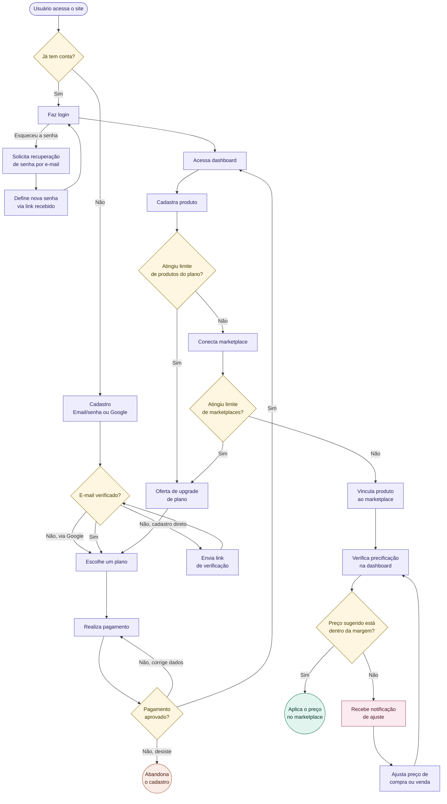

# Plataforma SaaS de Precificação para Marketplace

Documento de referência do MVP: modelo de dados, regras de negócio, fluxo do sistema e jornada do usuário.

---

## 1. Visão geral

Plataforma que permite ao vendedor cadastrar produtos, conectar contas de marketplaces (Shopee, TikTok Shop, Amazon, Mercado Livre etc.) e visualizar o preço que deve praticar em cada canal, considerando as regras de comissão/taxa de cada marketplace e a margem de lucro que o próprio vendedor definiu para aquele produto.

**Fluxo macro:**
usuário se cadastra → assina um plano → paga → acessa o sistema → cadastra produtos → conecta marketplaces → vincula produtos aos marketplaces conectados → consulta a dashboard de precificação.

---

## 2. Modelo de dados (Entidades)

### 2.1 Autenticação e usuários

- **`USER`** — dados da conta. `role` distingue `admin_master` de `user` e é o **único** controle de acesso no MVP (sem granularidade por grupo/tela — ver seção 6). `document` guarda CPF/CNPJ (necessário para billing e LGPD). `email_verified_at` fica nulo até a confirmação do e-mail (irrelevante para contas via Google, que já vêm verificadas pelo provider). `status` (`active`/`deleted`, default `active`) marca exclusão da própria conta pelo usuário (LGPD) — soft delete/anonimização (`name`/`email`/`password`/`document` apagados), nunca `DELETE` físico; histórico financeiro/auditoria ligado ao `id` continua íntegro. Não usa `SoftDeletes`/`deleted_at` nativo do Laravel de propósito — esconderia a linha de toda query por Global Scope, inclusive a futura tela de admin que precisa listar/ver qualquer usuário.
- **`PASSWORD_RESET`** — tabela padrão de recuperação de senha (mesmo padrão do Laravel: chave por `email`, sem FK). Pertence ao contexto `Identity`, junto com `USER` e `SSO_ACCOUNT`.
- **`SSO_ACCOUNT`** — login social separado do usuário. Um `USER` pode ter várias contas SSO (`provider` + `provider_id`). Providers previstos: `google`, `microsoft`. Guarda `access_token`/`refresh_token`/`expires_at` do provider (nullable, criptografados em repouso) — necessário pra revalidar a sessão OAuth quando o token expira, não só pro login inicial.

### 2.2 Planos e assinatura

- **`PLAN`** — define preço, ciclo de cobrança e os limites do plano: `max_products` e `max_marketplaces`. Não controla mais visibilidade de tela (ver seção 6) — só limites numéricos, validados na aplicação.
- **`SUBSCRIPTION`** — assinatura do usuário a um `PLAN`, com `status`, `start_date`, `end_date`. Modelo é **1 login = 1 assinatura**: `USER` tem histórico de `SUBSCRIPTION` (troca de plano, renovação), mas nunca duas ativas ao mesmo tempo — troca de plano **atualiza a mesma linha** (não cria uma nova `SUBSCRIPTION`). `pending_plan_id` (nullable) guarda uma troca de plano solicitada aguardando confirmação de pagamento via checkout Mercado Pago prorata — `plan_id` só muda de verdade quando o webhook aprova o pagamento. `cancel_at_period_end` (boolean, default `false`) marca cancelamento da renovação sem `DELETE` físico — usuário mantém acesso normal até `end_date` do ciclo já pago, sem reembolso; `status` continua `active` normalmente (mesmo modelo do Stripe).
- **`TRANSACTION`** — histórico de cobranças (assinatura e demais compras), com `gateway`, `gateway_transaction_id`, `status`, `value`, `payment_method`. Ligada a `USER` e, quando aplicável, a `SUBSCRIPTION`.

### 2.3 Produtos

- **`PRODUCT`** — cadastro do produto: `name`, `sku`, `ean`, `ncm`, `full_sale_price`, `purchase_price`, `target_margin` (percentual de lucro mínimo aceitável definido pelo próprio vendedor — é contra esse valor que o sistema compara o `suggested_price` para decidir se dispara notificação de ajuste). `weight` (kg) e `height`/`width`/`length` (cm) são opcionais (nullable) — mesma convenção de unidade usada por Correios/Shopee/Mercado Livre pra cálculo de frete; hoje só armazenados, ainda sem uso em nenhuma regra de precificação/frete.
- **`PRODUCT_LAUNCH`** — histórico de lançamentos/compras do produto: `purchase_price`, `quantity`, `date`.

### 2.4 Marketplaces e precificação

- **`MARKETPLACE`** — cadastro do canal de venda (Shopee, TikTok, Amazon, ML etc.), mantido pelo admin.
- **`PRICING_RULE`** — regras de cobrança do marketplace, por faixa de valor: `range_min`, `range_max`, `percentage`, `fixed_fee`, `order`. Permite quantas faixas forem necessárias por marketplace (ex.: até R$40 → 20% + R$4; acima de R$40 → 40% + R$10).
- **`USER_MARKETPLACE`** — vínculo do usuário com um marketplace (a "conta/loja" dele naquele canal). É essa entidade que limita quais marketplaces um produto pode ser vinculado.
- **`PRODUCT_MARKETPLACE`** — vínculo do produto com um `USER_MARKETPLACE` (não com o marketplace direto — isso garante que só é possível vincular produto a um marketplace que o próprio usuário já conectou). **Decisão 2026-08-26**: nesta rodada é um vínculo puro (`product_id` + `user_marketplace_id`), sem `suggested_price`/`is_approximated` — o cálculo de preço sugerido (`PricingCalculator`, já existente e testado isoladamente, nunca conectado a rota nenhuma) fica pra uma tela/tabela futura, ainda não desenhada. Só é possível criar o vínculo se o `USER_MARKETPLACE` referenciado estiver `active`.

### 2.5 Notificações, auditoria e configuração

- **`NOTIFICATION`** — conteúdo de um evento in-app (`type`, `title`, `message`, `status`), agnóstico de usuário (decisão 2026-08-26 — antes era 1 linha por destinatário). `title`/`message` aceitam tanto uma **chave** catalogada (`NotificationMessageKey`, mesma disciplina do `ApiMessageKey` das respostas de erro/sucesso da API) quanto texto livre — quem decide traduzir ou mostrar cru é o front, o backend só grava o que vier. `status` (`pending`/`sending`/`sent`/`cancelled`) só é relevante pra broadcast (envio pra 1 usuário nasce direto em `sent`, síncrono). Tipos previstos: vencimento de assinatura, preço fora da margem, regra de marketplace atualizada, lançamento registrado, **assinatura ativada** (implementado na Fase 4, tarefa 18 — `NotificationType::SubscriptionActivated`), **início de impersonation** (tarefa 29), **aviso do admin** (`AdminAnnouncement`, tarefa 42).
- **`USER_NOTIFICATION`** — entrega de uma `NOTIFICATION` pra 1 destinatário específico (`user_id`, `notification_id`, `read`). É aqui que mora "lida"/"não lida" — nunca em `NOTIFICATION`, que é conteúdo compartilhado sem dono. Um broadcast pra N usuários é sempre 1 `NOTIFICATION` + N `USER_NOTIFICATION`.
- **`AUDIT_LOG`** — log de auditoria: `action`, `module`, `description`, `ip_address`, ligado ao `USER` que executou a ação.
- **`SETTINGS`** — configurações internas da aplicação em formato chave-valor (`hash` como PK única, `name`, `value`, `type`). Tipos aceitos: `int`, `string`, `enum`, `text`, `json`, `bool`, `float`.

### 2.6 Diagrama de entidades (ERD)

```mermaid
erDiagram
    PLAN ||--o{ SUBSCRIPTION : defines
    USER ||--o{ SUBSCRIPTION : has
    USER ||--o{ PRODUCT : registers
    USER ||--o{ USER_MARKETPLACE : connects
    MARKETPLACE ||--o{ USER_MARKETPLACE : is_connected_by
    MARKETPLACE ||--o{ PRICING_RULE : has
    PRODUCT ||--o{ PRODUCT_LAUNCH : has
    PRODUCT ||--o{ PRODUCT_MARKETPLACE : links
    USER_MARKETPLACE ||--o{ PRODUCT_MARKETPLACE : receives
    USER ||--o{ USER_NOTIFICATION : receives
    NOTIFICATION ||--o{ USER_NOTIFICATION : delivered_as
    USER ||--o{ SSO_ACCOUNT : authenticates_via
    USER ||--o{ AUDIT_LOG : generates
    USER ||--o{ TRANSACTION : makes
    SUBSCRIPTION ||--o{ TRANSACTION : generates

    PLAN {
        uuid id PK
        string name
        decimal price
        string billing_cycle
        int max_marketplaces
        int max_products
        boolean active
        timestamp created_at
        timestamp updated_at
    }

    USER {
        uuid id PK
        string name
        string email
        timestamp email_verified_at
        string password_hash
        string document
        string role
        string status
        timestamp created_at
        timestamp updated_at
    }
    %% USER.document stores CPF or CNPJ (billing/LGPD)
    %% USER.role accepted values: admin_master, user — único controle de acesso no MVP (sem group_id/menu granular)
    %% USER.status accepted values: active, deleted (default active) — deleted = soft
    %% delete/anonimização (name/email/password/document apagados, nunca DELETE físico,
    %% histórico financeiro/auditoria ligado ao id continua íntegro). Não usa SoftDeletes/
    %% deleted_at nativo do Laravel de propósito — esconderia a linha de toda query por
    %% Global Scope, inclusive a tela de admin que precisa listar/ver qualquer usuário.

    SUBSCRIPTION {
        uuid id PK
        uuid user_id FK
        uuid plan_id FK
        uuid pending_plan_id FK
        string status
        boolean cancel_at_period_end
        string payment_id
        date start_date
        date end_date
        timestamp created_at
        timestamp updated_at
    }
    %% pending_plan_id (nullable): troca de plano solicitada, aguardando
    %% confirmação de pagamento (checkout Mercado Pago prorata) — plan_id só
    %% muda quando o webhook aprova o pagamento
    %% cancel_at_period_end (default false): cancelamento da renovação sem
    %% DELETE físico — mantém acesso até end_date, sem reembolso; status
    %% continua active normalmente (mesmo modelo do Stripe)

    PRODUCT {
        uuid id PK
        uuid user_id FK
        string name
        string sku
        string ean
        string ncm
        decimal full_sale_price
        decimal purchase_price
        decimal target_margin
        decimal weight
        decimal height
        decimal width
        decimal length
        timestamp created_at
        timestamp updated_at
    }
    %% weight (kg) e height/width/length (cm) são nullable — opcionais no
    %% cadastro, ainda sem uso em nenhuma regra de precificação/frete

    PRODUCT_LAUNCH {
        uuid id PK
        uuid product_id FK
        decimal purchase_price
        int quantity
        date date
        timestamp created_at
        timestamp updated_at
    }

    MARKETPLACE {
        uuid id PK
        string name
        boolean active
        timestamp created_at
        timestamp updated_at
    }

    USER_MARKETPLACE {
        uuid id PK
        uuid user_id FK
        uuid marketplace_id FK
        string store_name
        boolean active
        timestamp created_at
        timestamp updated_at
    }
    %% unique (user_id, marketplace_id): 1 conta por marketplace por usuário

    PRICING_RULE {
        uuid id PK
        uuid marketplace_id FK
        decimal range_min
        decimal range_max
        decimal percentage
        decimal fixed_fee
        int order
        timestamp created_at
        timestamp updated_at
    }

    PRODUCT_MARKETPLACE {
        uuid id PK
        uuid product_id FK
        uuid user_marketplace_id FK
        timestamp created_at
        timestamp updated_at
    }
    %% vínculo puro (decisão 2026-08-26) — suggested_price/is_approximated
    %% removidos nesta rodada, ficam pra uma tela/tabela futura quando o
    %% PricingCalculator (já existente) entrar em uso de verdade

    NOTIFICATION {
        uuid id PK
        string type
        string title
        text message
        string status
        timestamp created_at
        timestamp updated_at
    }
    %% Conteúdo agnóstico de usuário (decisão 2026-08-26) — sem user_id/read,
    %% isso mora em USER_NOTIFICATION. title/message aceitam CHAVE
    %% (NotificationMessageKey, mesma disciplina do ApiMessageKey) OU texto
    %% livre — o front decide traduzir ou mostrar cru. status
    %% (pending/sending/sent/cancelled) só é relevante pra broadcast.

    USER_NOTIFICATION {
        uuid id PK
        uuid user_id FK
        uuid notification_id FK
        boolean read
        timestamp created_at
        timestamp updated_at
    }
    %% entrega de 1 NOTIFICATION pra 1 destinatário — "lida"/"não lida" mora
    %% aqui, nunca em NOTIFICATION. unique (user_id, notification_id)

    SSO_ACCOUNT {
        uuid id PK
        uuid user_id FK
        string provider
        string provider_id
        text access_token
        text refresh_token
        timestamp expires_at
        timestamp created_at
        timestamp updated_at
    }
    %% SSO_ACCOUNT.provider accepted values: google, microsoft
    %% access_token/refresh_token nullable, criptografados em repouso (cast encrypted do Laravel)

    SETTINGS {
        string hash PK
        string name
        text value
        string type
        timestamp created_at
        timestamp updated_at
    }
    %% SETTINGS.type accepted values: int, string, enum, text, json, bool, float

    AUDIT_LOG {
        uuid id PK
        uuid user_id FK
        uuid impersonated_by FK
        string action
        string module
        text description
        string ip_address
        timestamp created_at
        timestamp updated_at
    }
    %% impersonated_by (nullable): FK pro admin ORIGINAL, preenchido só quando a ação
    %% foi feita durante uma impersonation (user_id continua sendo o usuário
    %% impersonado, dono do dado — impersonated_by só marca que foi via impersonation
    %% e por quem, ver seção 3 e mapeamento-cruds-admin.md)

    TRANSACTION {
        uuid id PK
        uuid user_id FK
        uuid subscription_id FK
        string gateway
        string gateway_transaction_id
        string status
        decimal value
        string payment_method
        timestamp created_at
        timestamp updated_at
    }

    PASSWORD_RESET {
        string email PK
        string token
        timestamp created_at
    }
    %% PASSWORD_RESET has no FK on purpose: mirrors Laravel's default password_reset_tokens table
    %% PASSWORD_RESET keeps only created_at (no updated_at) — mirrors Laravel's own password_reset_tokens migration, not a domain entity
```

---

## 3. Regras de negócio principais

- **Precificação flexível por marketplace** *(regra de negócio válida, implementação de cálculo ainda fora de uso — ver decisão 2026-08-26 abaixo)*: cada `MARKETPLACE` tem N `PRICING_RULE` (faixas de valor), cada uma com percentual + taxa fixa própria. O sistema aplica a faixa correspondente ao preço do produto para calcular o `suggested_price`.
- **Faixa não encontrada → aproximação** *(idem — regra ainda não conectada a nenhuma tela)*: se o preço do produto não cair em nenhuma faixa exata de `PRICING_RULE` daquele marketplace, o sistema usa a faixa mais próxima cadastrada como aproximação e marca `is_approximated = true`, para a UI avisar o vendedor que aquele valor não é exato — campo que vai morar na tela/tabela futura de sugestão de preço, não mais em `PRODUCT_MARKETPLACE` (decisão 2026-08-26, ver seção 2.4).
- **Margem definida pelo vendedor** *(idem)*: `PRODUCT.target_margin` é o percentual de lucro mínimo que o vendedor aceita para aquele produto. O `suggested_price` calculado é comparado contra essa margem; se ficar abaixo do aceitável, dispara `NOTIFICATION` do tipo "preço fora da margem".
- **Limite de produto e marketplace por plano**: `PLAN.max_products` e `PLAN.max_marketplaces` limitam, respectivamente, quantos produtos o usuário pode cadastrar e quantos marketplaces pode conectar. Validação feita na aplicação, comparando a contagem atual com o limite do plano.
- **Produto só vincula a marketplace conectado**: `PRODUCT_MARKETPLACE` referencia `USER_MARKETPLACE` (não `MARKETPLACE` direto), garantindo que o vínculo só existe dentro de um canal que o próprio usuário já conectou. O `USER_MARKETPLACE` referenciado precisa estar `active` no momento do vínculo — desativar a conexão depois (`active = false`) bloqueia NOVOS vínculos, mas não desfaz os já existentes (decisão 2026-08-26).
- **Uma conta por marketplace por usuário**: `USER_MARKETPLACE` tem unique `(user_id, marketplace_id)` — não há suporte a múltiplas lojas do mesmo usuário no mesmo canal no MVP.
- **Configuração de marketplace é restrita ao admin**: apenas `admin_master` cadastra marketplaces e suas `PRICING_RULE`.
- **Acesso é controlado só por `role`**: `admin_master` gerencia marketplaces/planos, `user` opera o próprio catálogo — sem granularidade por tela/grupo no MVP (ver seção 6). O limite por plano (`max_products`/`max_marketplaces`) é numérico, validado na Action, não visibilidade de tela.
- **Aplicação do preço é manual (MVP)**: `suggested_price` é informativo — o vendedor copia o valor e atualiza manualmente no marketplace. Integração automática via API do marketplace (exigindo credenciais em `USER_MARKETPLACE`) fica fora do escopo do MVP.
- **1 login = 1 assinatura**: não há suporte a múltiplos usuários dentro de uma mesma assinatura (conta compartilhada/time) no MVP.

---

## 3.1 Constraints de unicidade (para as migrations)

Não são representáveis de forma limpa no ERD em Mermaid, então ficam documentadas aqui:

| Tabela | Constraint |
|---|---|
| `USER` | unique `(email)` |
| `USER_MARKETPLACE` | unique `(user_id, marketplace_id)` |
| `PRODUCT_MARKETPLACE` | unique `(product_id, user_marketplace_id)` |
| `SSO_ACCOUNT` | unique `(provider, provider_id)` |
| `USER_NOTIFICATION` | unique `(user_id, notification_id)` |

---

## 4. Diagrama de fluxo do sistema

---

## 5. Diagrama de jornada do usuário

Mapeia as vertentes possíveis: login vs. cadastro, verificação de e-mail, recuperação de senha, falha de pagamento, limite de plano atingido, e preço fora da margem.

---

## 6. Pontos em aberto para validação

- **Recuperação de pagamento abandonado**: hoje termina em churn simples; pode virar um fluxo próprio (ex. e-mail de cobrança) se necessário.

Resolvidos (registro histórico, não reabrir sem novo motivo de negócio):
- **Trial**: não entra no MVP — jornada sempre segue `ChoosePlan → Payment`, sem branch de teste gratuito.
- **`SSO_ACCOUNT`**: estendido com `access_token`, `refresh_token`, `expires_at` (ver seção 2.1 e ERD).
- **`USER_MARKETPLACE`**: confirmado que não guarda credencial de API no MVP — aplicação do preço continua manual (ver seção 3).
- **`USER.group_id`**: removido do MVP, junto com `USER_GROUP`, `MENU`, `GROUP_MENU` e `PLAN_GROUP`. Motivo: nenhum consumidor real hoje — planos diferem só em limite numérico (`max_products`/`max_marketplaces`), não em visibilidade de tela; a cadeia `Plan→PlanGroup→UserGroup→GroupMenu→Menu` seria infraestrutura de permissão pronta para um cenário que ainda não existe no produto (viola KISS). Acesso no MVP é só `USER.role` (`admin_master`/`user`) + validação de limite numérico na Action. Se o produto passar a ter telas/features diferentes por plano, isso volta como migration nova.